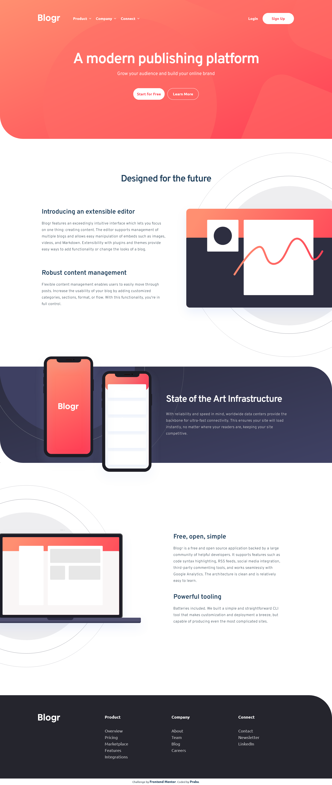

# FEM - Blogr Landing Page

### Links

[Challenge from FrontendMentor](https://www.frontendmentor.io/challenges/blogr-landing-page-EX2RLAApP)\
[Live site here](https://mgksp-fem-blogr-lp.netlify.app/)

### Built with

- vite
- react
- typescript
- tailwindcss
- framer-motion

### Screenshots

<table>
  <tr>
    <td>Mobile Version</td>
    <td>Desktop Version</td>
  </tr>
  <tr valign="top">
    <td></td>
    <td></td>
  </tr>
</table>
